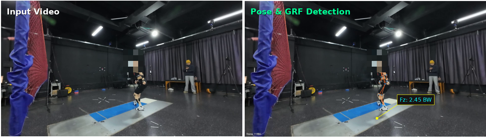

<div align="center">
  
</div>

<div align="center">
  <h1>🏸 BadmintonGRF</h1>
  <h3>A Multimodal Dataset and Benchmark for Markerless Ground Reaction Force Estimation in Badminton</h3>
  
  [](https://acmmm2026.org/)
  [](https://doi.org/10.5281/zenodo.19277566)
  [](LICENSE)
  [](LICENSE-DATA-CC-BY-NC-4.0.txt)
  [](https://www.python.org/downloads/release/python-3100/)

  [**Project Page**](https://KenyaNiu.github.io/BadmintonGRF/) |
  [**Dataset (Tier 1)**](https://doi.org/10.5281/zenodo.19277566) |
  [**Supplementary Material**](https://github.com/KenyaNiu/BadmintonGRF/blob/main/docs/paper_supplementary.md)
</div>

<br>

**BadmintonGRF** is a study-grade, large-scale multimodal dataset designed to advance non-contact Ground Reaction Force (GRF) estimation and biomechanics research in intermittent sports. It pairs high-frame-rate multi-view video with laboratory-grade in-floor force plates and Vicon motion capture, featuring human-verified alignment and rigorous benchmark protocols.

## 🌟 Highlights

- 🎥 **Multi-View High-Speed RGB**: 8 fixed cameras recording at ~120 FPS.
- ⚖️ **Laboratory Ground Truth**: 4 Kistler 6-axis force plates (1000/1200 Hz) and 8-camera Vicon C3D mocap.
- 🏸 **Impact-Centric Badminton Protocol**: Focuses on high-intensity, non-periodic footwork and landings, with fatigue-stage stratification.
- ⏱️ **Software-Level Alignment**: Human-in-the-loop video-GRF alignment with automatic QA, avoiding the need for expensive hardware genlock.
- 📊 **Comprehensive Benchmark**: 10 reproducible baseline models (e.g., PatchTST, ST-GCN, TSMixer) with a rigorous Leave-One-Subject-Out (LOSO) evaluation protocol and optional late fusion.
- 🔒 **Tiered Privacy Release**: CC BY-NC 4.0 for processed pose+GRF (Tier 1), and controlled access for raw RGB/C3D (Tier 2).
- 🎮 **Online Demo**: Try our Gradio-based web demo for real-time GRF estimation from badminton videos!

## �️ Data Alignment Software

We developed a specialized **Video-GRF Alignment Interface** to ensure precise synchronization between video frames and force plate data. This tool enables human-in-the-loop alignment with sub-frame accuracy, eliminating the need for expensive hardware genlock systems.

<div align="center">
  
</div>

### Key Features

- **Real-time Video Playback**: Preview badminton footwork with synchronized pose overlay
- **GRF Visualization**: Interactive graphs showing vertical, horizontal, and lateral ground reaction forces
- **Precise Synchronization**: Manual event marking for video frames and GRF peaks
- **Offset Calculation**: Automatic calculation of time offsets between video and force plate systems
- **Quality Control**: Built-in validation tools to ensure alignment accuracy
- **Batch Processing**: Support for processing multiple trials efficiently

This alignment software is a critical component of our pipeline (`pipeline/step1_align_ui.py`), enabling high-quality data preparation for both the benchmark and downstream research applications.

## �📢 News
- **[2026-03]** 🏸 BadmintonGRF dataset and benchmark code are officially released!
- **[2026-03]** 🎮 Gradio demo and inference engine are now available for real-time GRF estimation.

## 📎 Supplementary Material (ACM MM 2026)

Reviewer-facing details—schema, QA audits, LOSO benchmark reproduction, and checklists—live in the repo as Markdown (rendered on GitHub):

**[docs/paper_supplementary.md](https://github.com/KenyaNiu/BadmintonGRF/blob/main/docs/paper_supplementary.md)**

Related: [artifact inventory](https://github.com/KenyaNiu/BadmintonGRF/blob/main/docs/supp_artifact_inventory.md), [Tier-2 access policy](https://github.com/KenyaNiu/BadmintonGRF/blob/main/docs/video_access_policy.md).

## 📊 Dataset Overview

We provide 17,425 impact-segment archives collected from elite athletes. After applying strict quality gates, the benchmark features **12,867 valid instances** corresponding to **1,732 unique impacts**. 

| Modality | Description |
|---|---|
| **Video** | 8 views × ~120 FPS (DJI Osmo Action 4) |
| **Pose** | 2D COCO-17 via YOLO26-pose + ByteTrack |
| **GRF** | 6-axis forces from 4 Kistler plates (1000/1200 Hz) |
| **Mocap** | Vicon C3D (~52 markers, 240/250 Hz) |

*For full dataset schema and statistics, please refer to our [Project Page](https://KenyaNiu.github.io/BadmintonGRF/).*

## 🏆 Benchmark Results

We benchmark 10 distinct models under a fixed **Leave-One-Subject-Out (LOSO)** protocol to assess cross-subject generalization. The target is predicting the body-weight (BW) normalized vertical force ($F_z$).

| Model | $r^2$ $\uparrow$ | RMSE (BW) $\downarrow$ | Peak Error (BW) $\downarrow$ | Peak Timing (frames) $\downarrow$ |
|:---|:---:|:---:|:---:|:---:|
| **PatchTST** | **0.403** | **0.510** | 0.226 | 1.07 |
| **ST-GCN+Transformer** | 0.394 | 0.514 | **0.221** | **0.96** |
| **TCN+BiGRU** | 0.390 | 0.514 | 0.348 | 3.79 |
| **TSMixer** | 0.351 | 0.531 | 0.218 | 1.85 |
| **Seq-Transformer** | 0.345 | 0.533 | 0.281 | 1.82 |

*(Results shown for LOSO Single-View. For multi-view late fusion and within-trial diagnostic results, see the main paper.)*

## 🚀 Getting Started

### 1. Installation

```bash
# Clone the repository
git clone https://github.com/KenyaNiu/BadmintonGRF.git
cd BadmintonGRF

# Create and activate conda environment
conda env create -f environment.yml
conda activate badminton_grf
```

### 2. Data Preparation

1. Download the **Tier 1 (Public)** dataset from [Zenodo](https://doi.org/10.5281/zenodo.19277566).
2. Extract the data and set the environment variable:
   ```bash
   export BADMINTON_DATA_ROOT=/path/to/extracted/data
   ```

### 3. Running Baselines

We provide a unified CLI and bash scripts to easily train and evaluate all baselines.

```bash
# Run all baseline models sequentially
bash run_all_baselines.sh

# Or run a specific baseline (e.g., PatchTST)
bash run_all_baselines.sh train patch_tst

# Using the Python CLI directly for advanced options
python -m baseline train --method patch_tst \
    --loso_splits $BADMINTON_DATA_ROOT/reports/loso_splits_10p.json \
    --run_dir runs/patch_tst_loso
```

### 4. Using the Inference Engine

We provide a standalone `InferenceEngine` class for running GRF estimation on new badminton videos:

```python
from inference_engine import InferenceEngine

# Initialize the engine with pre-trained models
engine = InferenceEngine(
    yolo_model_path="yolo26l-pose.pt",
    grf_model_path="runs/benchmark_bundle_20260325/patch_tst_xl/fold_sub_007/best_model.pth",
    device="cuda"  # or "cpu"
)

# Process a video and get GRF predictions
processed_video, stats = engine.process_video(
    "path/to/your/badminton_video.mp4",
    output_path="output.mp4"
)

# Access prediction statistics
print(f"Fz mean: {stats['fz_mean_bw']:.2f} BW")
print(f"Fz peak: {stats['fz_peak_bw']:.2f} BW")
```

### 5. Running the Gradio Demo

We provide an interactive Gradio web interface for easy testing:

```bash
# Run the demo (requires GUI or accessible web browser)
python app.py
```

The demo allows you to:
- Upload badminton videos
- Visualize pose estimation results
- View real-time GRF estimation outputs
- Download processed videos with overlaid predictions

## 📁 Repository Structure

```
BadmintonGRF/
├── app.py                      # Gradio web demo application
├── inference_engine.py         # Standalone inference engine for GRF estimation
├── baseline/                   # 10 baseline models, LOSO training loops, and tasks
│   ├── models/                 # Model architectures (PatchTST, ST-GCN, TSMixer, etc.)
│   ├── tasks/                  # Training and evaluation tasks
│   └── training/               # Training utilities, metrics, and LOSO splits
├── pipeline/                   # End-to-end data processing pipeline
│   ├── step0_extract_grf.py    # Extract GRF from force plates
│   ├── step1_align_ui.py       # Video-GRF alignment interface
│   ├── step2_verify_sync.py    # Synchronization verification
│   ├── step3_extract_pose.py   # Pose estimation with YOLO
│   └── step4_segment.py        # Impact segment generation
├── tools/                      # Dataset scanning and validation scripts
├── docs/                      # Project page, supplementary material, policies
├── paper/                     # ACM MM 2026 paper LaTeX source
├── pretrained/               # Pre-trained model weights
├── runs/                     # Training logs and checkpoints
├── zenodo_upload/            # Data upload utilities
├── run_all_baselines.sh      # Automated benchmarking script
├── environment.yml           # Conda environment specification
├── yolo26l-pose.pt          # YOLO26 pose estimation model
└── yolo11l-pose.pt          # YOLO11 pose estimation model (backup)
```

## 🎮 Demo Preview

The Gradio demo provides an intuitive interface for:

1. **Video Upload**: Drag and drop badminton videos
2. **Pose Visualization**: See YOLO pose estimation on the athlete
3. **GRF Estimation**: View predicted ground reaction forces overlaid on video
4. **Statistics**: Display key metrics like peak force and mean force in BW

## 📜 License & Access

- **Code**: Released under the [MIT License](LICENSE).
- **Data (Tier 1)**: Processed segments (Pose + Aligned GRF) are released under [CC BY-NC 4.0](LICENSE-DATA-CC-BY-NC-4.0.txt).
- **Data (Tier 2)**: Raw RGB videos and C3D mocap data are available under controlled access for privacy protection. Please check the project page for application details.

## 🤝 Acknowledgments

We extend our deepest gratitude to all the elite athletes from **Wuhan Sports University** who participated in this study, and the experimental staff for their professional support during the data collection process.

---

*If you find this work useful, please cite our paper:*

```bibtex
@article{badmintongrf2026,
  title={BadmintonGRF: A Multimodal Dataset and Benchmark for Markerless Ground Reaction Force Estimation in Badminton},
  author={Niu, Kuoye and Li, Jianwei and Cai, Shengze and Ma, Yong and Jia, Mengyao and Shen, Lishun and Zhang, Zhenheng and Peng, Yuxin and Song, Xian},
  journal={ACM Multimedia 2026},
  year={2026}
}
```
